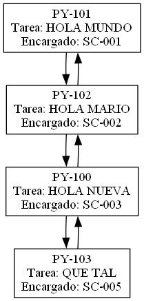

# FASE 1 EDD

## Introducción

Con el proyecto se busca aplicar los conocimientos del curos de Estructuras de Datos en el desarrollo de las diferentes estructuras de datos y los diferentes algoritmos de manipulacion de la información en ellas.

## Requisitos

Con los siguientes requisitos se realizó el proyecto:

### Software

-CodeBlocks
-C++
-Librería nlohmann/json.hpp

### Hardware

-Al menos 4GB de RAM

## Clase 'main()'

La función `main()` es el punto de entrada del programa. Aquí es donde se inicializan las variables y se llaman a las funciones principales para ejecutar las tareas del programa.


## Encabezados

Estos archivos de encabezado contiene funciones utilitarias que se utilizan en diferentes clases en todo el proyecto, como funciones para manejar cadenas, retornar cadenas y guardar informacion.


## Clase Lista

La clase Lista implementa una lista circular doblemente enlazada para almacenar empleados del sistema. Cada nodo de la lista contiene información como el nombre, la contraseña y el código del empleado.

### Atributos

-Primero: Puntero al primer nodo de la lista.
-Tamanio: Entero que almacena el número de nodos en la lista.

### Métodos

-Lista()

Constructor de la clase que inicializa Primero en 0 y Tamanio en 0.

~Lista()

Destructor de la clase.

### void Insertar(std::string nombre, std::string password)

Inserta un nuevo nodo en la lista con el nombre y la contraseña proporcionados. Genera un código único para el empleado.

### void VerLista()

Imprime la lista de empleados mostrando su código y nombre.

### void VerLista1()

Imprime la lista de empleados mostrando su puesto y nombre.

### std::string BuscarPorCodigo(const std::string& codigo)

Busca un empleado por su código y devuelve su nombre. Si el empleado no se encuentra, devuelve "Empleado no encontrado".

### void LeerArchivo(std::string nombre_archivo)

Lee un archivo CSV para cargar empleados en la lista. El archivo debe tener las columnas "nombre" y "password".

### void Graficar()

Genera un archivo de gráfico en formato DOT y crea una imagen PNG de la lista utilizando Graphviz.

Ejemplo de Uso:

```cpp
// Crear una lista
Lista miLista;

// Insertar empleados
miLista.Insertar("Alice", "password1");
miLista.Insertar("Bob", "password2");

// Ver lista
miLista.VerLista();

// Buscar por código
std::string nombre = miLista.BuscarPorCodigo("SC-001");
```

## Clase ColaPrioridad

La clase ColaPrioridad implementa una cola con prioridad para gestionar proyectos. Cada nodo de la cola contiene información como el nombre del proyecto y el tipo de prioridad.

### Atributos

-Primero: Puntero al primer nodo de la cola.
-Tamanio: Entero que almacena el número de nodos en la cola.

### Métodos

-ColaPrioridad()
Constructor de la clase que inicializa Primero en 0 y Tamanio en 0.

~ColaPrioridad()
Destructor de la clase.

### void Encolar(std::string Nombre, std::string Tipo_de_Prioridad)

Agrega un nuevo nodo a la cola con el nombre del proyecto y el tipo de prioridad. Genera un código único para el proyecto.

### void Ordenar()

Ordena la cola en función de la prioridad.

### bool VerProyectos()

Imprime la lista de proyectos mostrando su código y nombre. Devuelve true si hay proyectos en la cola.

### void Descolar()

Elimina el primer nodo de la cola.

### void Graficar()

Genera un archivo de gráfico en formato DOT y crea una imagen PNG de la cola utilizando Graphviz.

Ejemplo de Uso

```cpp
// Crear una cola de prioridad
ColaPrioridad miCola;

// Encolar proyectos
miCola.Encolar("Proyecto A", "A");
miCola.Encolar("Proyecto B", "B");

// Ver proyectos
miCola.VerProyectos();

// Ordenar la cola por prioridad
miCola.Ordenar();

// Descolar el primer proyecto
miCola.Descolar();
```

## Clase ListaDoble

La clase ListaDoble implementa una lista doblemente enlazada para gestionar tareas en proyectos. Cada nodo de la lista contiene información como el código del proyecto, el nombre de la tarea y el código del encargado.

### Atributos

-Primero: Puntero al primer nodo de la lista.
-Tamanio: Entero que almacena el número de nodos en la lista.

### Métodos

ListaDoble()
Constructor de la clase que inicializa Primero en 0 y Tamanio en 0.

~ListaDoble()
Destructor de la clase.

### void Insertar(std::string codigo, std::string nombre_tarea, std::string codigo_encargado)

Inserta un nuevo nodo en la lista con el código del proyecto, el nombre de la tarea y el código del encargado.

### void Asignar(std::string codigo, std::string nombre_tarea, std::string encargado)

Asigna un encargado a una tarea específica en un proyecto específico.

### void Graficar()

Genera un archivo de gráfico en formato DOT y crea una imagen PNG de la lista utilizando Graphviz.

### void MostrarTareasPorProyecto(std::string codigo_proyecto)

Muestra todas las tareas asociadas a un proyecto específico.

### std::vector<std::pair<std::string, std::string>> buscarTareasPorProyecto(std::string codigoProyecto)

Devuelve un vector de pares que contienen el nombre de la tarea y el código del encargado para un proyecto específico.

Ejemplo de Uso

```cpp
// Crear una lista doble
ListaDoble miLista;

// Insertar tareas
miLista.Insertar("PROY-1", "Tarea A", "QA-1");
miLista.Insertar("PROY-1", "Tarea B", "QA-2");

// Asignar encargado a una tarea
miLista.Asignar("PROY-1", "Tarea A", "BDEV-3");

// Mostrar tareas por proyecto
miLista.MostrarTareasPorProyecto("PROY-1");
```

## Clase Matriz

La clase Matriz implementa una matriz dispersa para gestionar proyectos y empleados. Cada nodo de la matriz contiene información como el proyecto, el empleado, y sus respectivas coordenadas en la matriz.

### Atributos

-Raiz: Nodo raíz de la matriz.
-CoordenadaX: Coordenada X para la inserción de nuevos proyectos.
-CoordenadaY: Coordenada Y para la inserción de nuevos empleados.
-lista: Puntero a una lista de empleados (no utilizado en el código actual).

### Métodos

Matriz()
Constructor que inicializa la raíz y las coordenadas.

~Matriz()
Destructor de la clase.

### NodoMatriz* buscarF(int y)

Busca un nodo en la matriz por su coordenada Y.

### NodoMatriz* buscarC(int x)

Busca un nodo en la matriz por su coordenada X.

### NodoMatriz* insertar_columna(NodoMatriz *nuevo, NodoMatriz *cabeza_columna)

Inserta una nueva columna en la matriz.

### NodoMatriz* insertar_fila(NodoMatriz *nuevo, NodoMatriz *cabeza_fila)

Inserta una nueva fila en la matriz.

### void insertar_proyecto(ColaPrioridad *cola)

Inserta un nuevo proyecto en la matriz.

### void insertar_empleado(Lista *lista)

Inserta nuevos empleados en la matriz.

### void asignarProyecto(std::string nombre_empleado, std::string codigo_proyecto, std::string puesto)

Asigna un proyecto a un empleado.

### void BuscarProyecto(std::string codigo, std::string nombre_tarea)

Busca un proyecto por su código y asigna una tarea.

### void BuscarEmpleado(std::string codigo, std::string nombre_tarea, std::string nombre_empleado)

Busca un empleado por su nombre y asigna una tarea.

### void Graficar()

Genera un archivo de gráfico en formato DOT y crea una imagen JPG de la matriz utilizando Graphviz.

### void generarJSON(Cola1 *cola, ListaDoble *lista)

Genera un archivo JSON con información sobre los proyectos y las tareas.

Ejemplo de Uso

```cpp
// Crear una matriz
Matriz miMatriz;

// Insertar proyecto
ColaPrioridad cola;
// (Asumiendo que la cola ya tiene proyectos)
miMatriz.insertar_proyecto(&cola);

// Insertar empleado
Lista lista;
// (Asumiendo que la lista ya tiene empleados)
miMatriz.insertar_empleado(&lista);

// Asignar proyecto a empleado
miMatriz.asignarProyecto("Empleado1", "PROY-1", "FDEV-01");

// Generar gráfico
miMatriz.Graficar();

// Generar JSON
miMatriz.generarJSON(&cola, &lista);
```

## Funcion 'graficar()'

La función graficar es una función auxiliar que se encarga de llamar a los métodos de graficación y generación de JSON para diferentes estructuras de datos, incluyendo una lista, una cola de prioridad, una matriz y una lista doble. Después de realizar estas operaciones, redirige al usuario de nuevo al menú principal.

### Funcionalidades

Grafica la matriz de proyectos y empleados.
Grafica la cola de prioridad de proyectos.
Grafica la lista de empleados.
Grafica la lista doble de tareas.
Genera un archivo JSON con información sobre los proyectos y las tareas.
Redirige al usuario al menú principal.


### Ejemplos de las graficas





