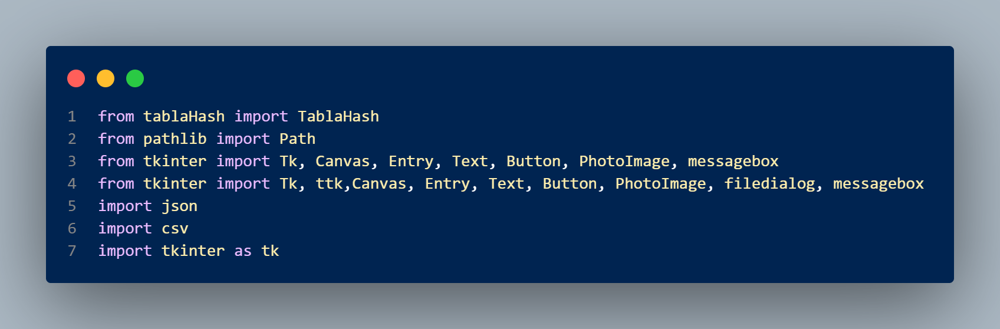
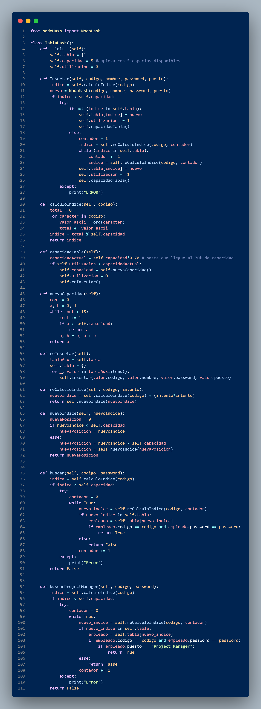
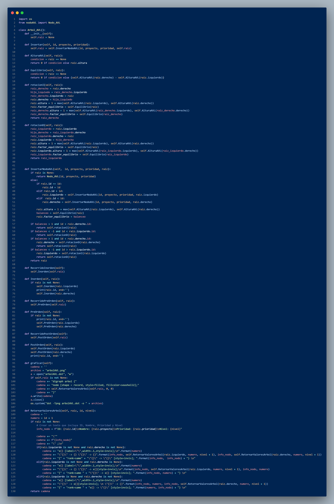
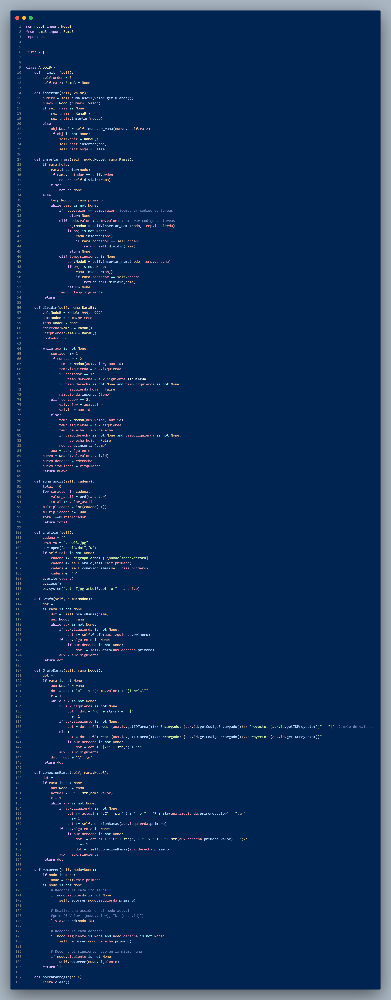
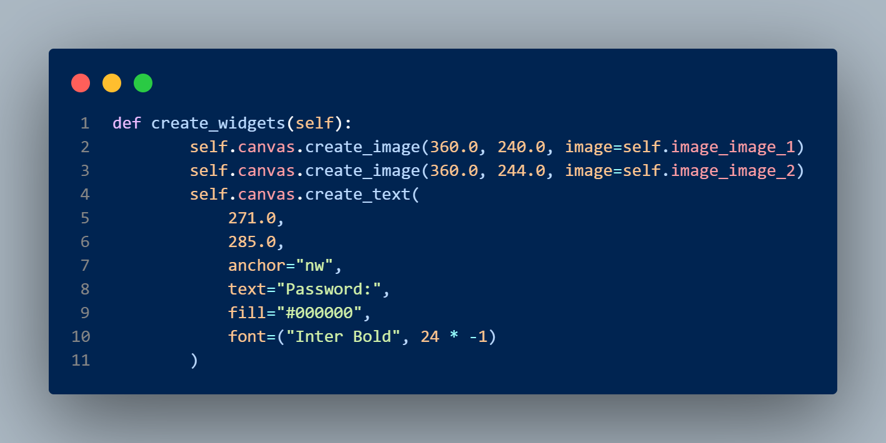
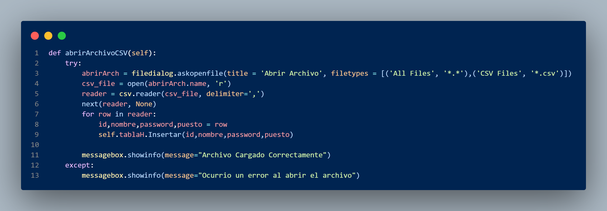
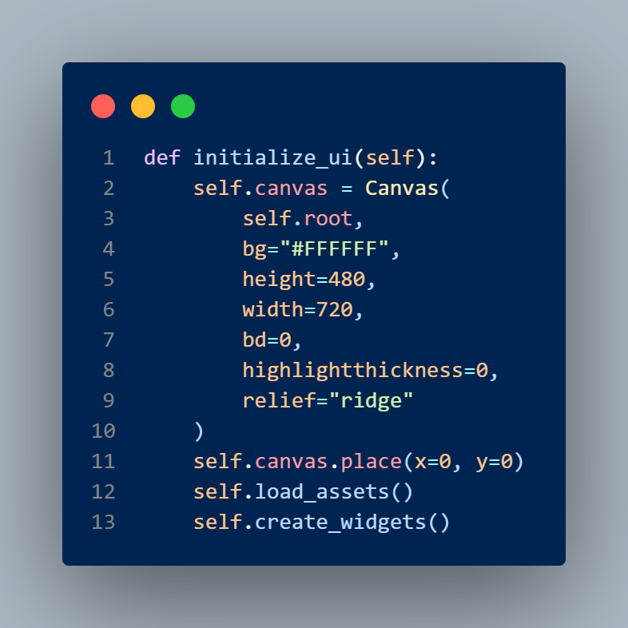
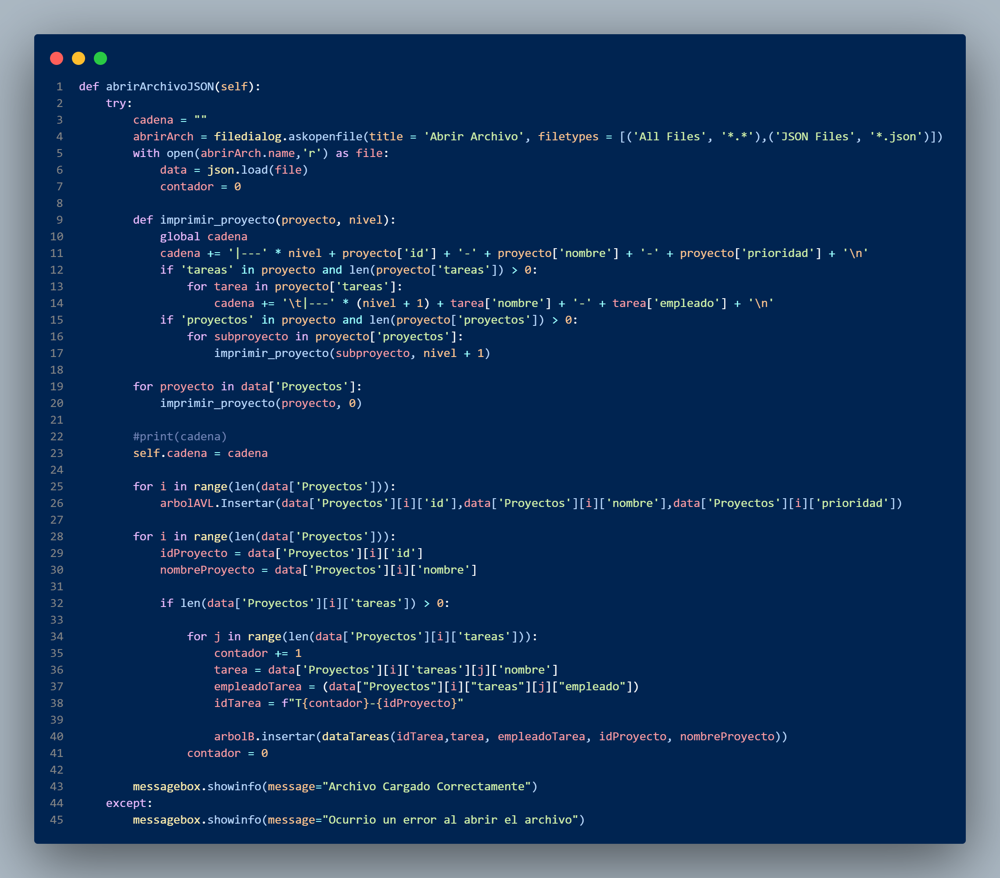
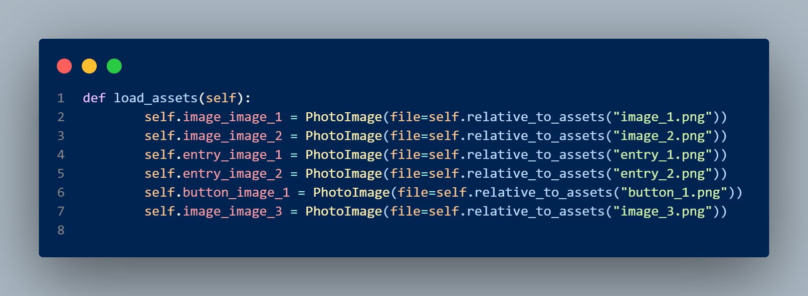
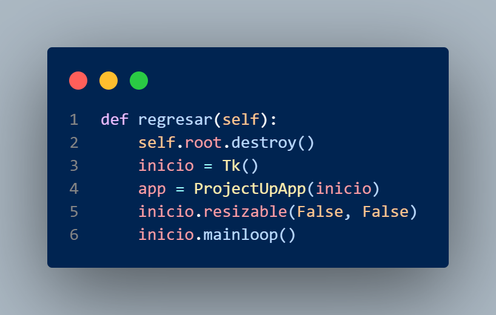

# MANUAL TÉCNICO_Fase 2

## Introduccion

Con el proyecto se busca aplicar los conocimientos del curos de Estructuras de Datos en el desarrollo de las diferentes estructuras de datos y los diferentes algoritmos de manipulacion de la información en ellas.

## Requisitos

### Software utilizado

-Visual Studio Code

### Hardware

-Al menos 4 GB de RAM

## Librerías Utilizadas

1.**`pathlib`**: Proporciona una interfaz orientada a objetos para trabajar con rutas de archivos y directorios en un sistema de archivos.

2.**`tkinter`**: Una librería estándar de Python para crear interfaces gráficas de usuario (GUI). Se utilizan clases como `Tk`, `Canvas`, `Entry`, `Text`, `Button`, `PhotoImage`, `messagebox`, y `ttk` para crear elementos de GUI.

3.**`json`**: Permite trabajar con datos en formato JSON (JavaScript Object Notation), incluyendo la serialización y deserialización de datos.

4.**`csv`**: Utilizada para trabajar con archivos CSV (Comma-Separated Values), proporcionando funciones para leer y escribir datos en este formato.

5.**`tkinter as tk`**: Importa `tkinter` con el alias "tk" para abreviar el nombre de la librería en el código.

## Clase TablaHash

La clase `TablaHash` implementa una estructura de datos de tabla hash en Python. La tabla hash se utiliza para almacenar elementos (en este caso, objetos `NodoHash`) de manera eficiente utilizando un código de clave como índice. A continuación, se describe el código y sus métodos:

#### Constructor `__init__`

- `self.tabla`: Un diccionario que representa la tabla hash. Inicialmente, está vacío.

- `self.capacidad`: La capacidad inicial de la tabla, que comienza en 5 espacios disponibles.

- `self.utilizacion`: Un contador de la cantidad de elementos en la tabla.

#### Método `Insertar`

- Este método se utiliza para insertar un nuevo elemento en la tabla hash.

- Calcula un índice utilizando el método `calculoIndice`, verifica si el índice está disponible y, si no lo está, utiliza un algoritmo de rehashing para encontrar un nuevo índice disponible.

- Luego, crea un nuevo objeto `NodoHash` con los datos proporcionados y lo inserta en la tabla.

- Actualiza la capacidad de la tabla si es necesario utilizando el método `capacidadTabla`.

#### Método `calculoIndice`

- Calcula un índice a partir de un código dado sumando los valores ASCII de sus caracteres y tomando el módulo de la capacidad de la tabla.

#### Método `capacidadTabla`

- Comprueba si la tabla está ocupada al 70% de su capacidad actual.

- Si se supera este umbral, aumenta la capacidad utilizando el método `nuevaCapacidad` y luego reorganiza la tabla con el método `reInsertar`.

#### Método `nuevaCapacidad`

- Calcula una nueva capacidad utilizando la secuencia de Fibonacci.

#### Método `reInsertar`

- Reorganiza la tabla después de aumentar su capacidad.

#### Método `reCalculoIndice`

- Calcula un nuevo índice en caso de colisión utilizando una fórmula que incluye un intento.

#### Método `nuevoIndice`

- Calcula el nuevo índice para gestionar colisiones.

#### Método `buscar`

- Busca un elemento en la tabla hash utilizando un código y una contraseña dados.

- Utiliza la función `calculoIndice` para calcular el índice y luego busca el elemento en la tabla, manejando colisiones con el método `reCalculoIndice`.

#### Método `buscarProjectManager`

- Similar a `buscar`, pero busca específicamente un "Project Manager" basándose en el puesto del empleado.

- Verifica si el empleado tiene el puesto "Project Manager" después de encontrarlo en la tabla.

Estos métodos permiten gestionar la inserción, búsqueda y organización de elementos en la tabla hash implementada en la clase `TablaHash`.

## Clase Arbol_AVL

La clase `Arbol_AVL` implementa una estructura de datos de árbol AVL en Python. Los árboles AVL son árboles binarios de búsqueda equilibrados que mantienen una propiedad de balance para garantizar una búsqueda eficiente. A continuación, se describen los aspectos clave del código y sus métodos:

#### Constructor `__init__`

- `self.raiz`: Inicializa la raíz del árbol AVL como `None`.

#### Método `Insertar`

- Permite insertar un nuevo nodo en el árbol AVL. Este método llama a `InsertarNodoAVL` para realizar la inserción.

#### Método `AlturaAVL`

- Calcula la altura de un nodo dado del árbol AVL.

#### Método `Equilibrio`

- Calcula el factor de equilibrio de un nodo, que es la diferencia entre las alturas de sus subárboles izquierdo y derecho.

#### Métodos `rotacionI` y `rotacionD`

- Implementan rotaciones izquierda (rotaciónI) y derecha (rotaciónD) para mantener el equilibrio del árbol AVL cuando sea necesario.

#### Método `InsertarNodoAVL`

- Realiza la inserción de un nuevo nodo en el árbol AVL.

#### Métodos de Recorrido (`RecorridoInorden`, `RecorridoPreOrden`, `RecorridoPostOrden`)

- Estos métodos permiten recorrer el árbol en diferentes órdenes: inorden, preorden y postorden.

#### Método `graficar`

- Genera una representación gráfica del árbol AVL utilizando el lenguaje DOT y Graphviz. El resultado se almacena en un archivo llamado "arbolAVL.png".

- El método crea un archivo DOT llamado "arbolAVL.dot" que contiene la descripción del árbol en formato DOT, que luego se convierte en una imagen usando el comando `dot` de Graphviz.

- Utiliza recursión para construir la descripción del árbol en formato DOT, incluyendo información sobre el ID, el proyecto, la prioridad y el nivel de cada nodo.

## Clase ArbolB

La clase `ArbolB` implementa una estructura de datos de árbol B en Python. Los árboles B son estructuras de datos de búsqueda y almacenamiento que se utilizan comúnmente en bases de datos y sistemas de archivos para organizar y buscar datos de manera eficiente. A continuación, se describen los aspectos clave del código y sus métodos:

#### Constructor `__init__`

- `self.orden`: Establece el orden del árbol B (por defecto, se establece en 3).

- `self.raiz`: Inicializa la raíz del árbol B como `None`.

#### Método `insertar`

- Permite insertar un nuevo valor en el árbol B.

- Convierte el valor en un número utilizando la función `suma_ascii` basada en el valor ASCII de los caracteres de la cadena.

- Si la raíz es `None`, crea una nueva rama y la inserta.

- Si la raíz no es `None`, llama al método `insertar_rama` para insertar el valor en la rama correspondiente.

#### Método `insertar_rama`

- Inserta un valor en una rama dada.

- Verifica si la rama es una hoja. Si es una hoja y alcanza el límite de tamaño (`orden`), se divide la rama.

- Si la rama no es una hoja, se busca el lugar adecuado para insertar el valor recursivamente.

#### Método `dividir`

- Divide una rama si excede el tamaño límite (`orden`).

- Crea nuevas ramas izquierda y derecha a partir de los valores existentes en la rama actual.

#### Método `suma_ascii`

- Calcula un valor numérico a partir de una cadena sumando los valores ASCII de sus caracteres y multiplicando por el último dígito de la cadena.

#### Método `graficar`

- Genera una representación gráfica del árbol B utilizando el lenguaje DOT y Graphviz. El resultado se almacena en un archivo llamado "arbolB.jpg".

- El método crea un archivo DOT llamado "arbolB.dot" que contiene la descripción del árbol en formato DOT, que luego se convierte en una imagen usando el comando `dot` de Graphviz.

#### Métodos `Grafo`, `GrafoRamas` y `conexionRamas`

- Estos métodos generan la descripción gráfica del árbol B en formato DOT, incluyendo etiquetas y conexiones entre nodos.

#### Método `recorrer`

- Realiza un recorrido del árbol B (inorden) y almacena los valores en una lista llamada `lista`.

#### Método `borrarArreglo`

- Limpia la lista `lista` utilizada en el método `recorrer`.

## FUNCIONES

### Funcion create_widgets:

Se encarga de crear varios widgets en una ventana, como imágenes, textos, botones y campos de entrada. A continuación, se detalla lo que hace cada llamada de método o creación de widget:

- `self.canvas.create_image(360.0, 240.0, image=self.image_image_1)`: Crea una imagen en un lienzo (canvas) en las coordenadas (360.0, 240.0) utilizando una imagen cargada desde `self.image_image_1`.

- `self.canvas.create_image(360.0, 244.0, image=self.image_image_2)`: Crea otra imagen en el mismo lienzo a una coordenada ligeramente diferente utilizando `self.image_image_2`.

- `self.canvas.create_text(...)`: Crea dos textos en el lienzo, uno que dice "Password:" en las coordenadas (271.0, 285.0) y otro que dice "User Name:" en las coordenadas (261.0, 206.0). Ambos textos utilizan una fuente llamada "Inter Bold" con un tamaño de 24 y un color de texto negro (#000000).

- `self.button_1 = Button(...)`: Crea un botón con una imagen (`self.button_image_1`) como su apariencia. Se configuran algunas propiedades del botón, como el borde, el grosor del resaltado y la función que se ejecutará cuando se haga clic en el botón (en este caso, la función `self.obtener()`).

- `self.canvas.create_image(353.5, 250.0, image=self.entry_image_1)`: Crea una imagen en el lienzo para decorar un campo de entrada de texto.

- `self.entry_1 = Entry(...)`: Crea un campo de entrada de texto (`Entry`) con algunas propiedades, como el grosor del borde, el color de fondo y el color del texto. Este campo se coloca en las coordenadas (205.0, 234.0) con un ancho de 297.0 y una altura de 30.0.

- `self.canvas.create_image(353.5, 327.0, image=self.entry_image_2)`: Crea otra imagen en el lienzo para decorar un segundo campo de entrada de texto.

- `self.entry_2 = Entry(...)`: Crea otro campo de entrada de texto similar al anterior pero con un atributo adicional `show="*"` que oculta el texto que se ingrese (posiblemente para contraseñas). Se coloca en las coordenadas (205.0, 311.0) con las mismas dimensiones que el campo anterior.

- `self.canvas.create_image(360.0, 125.0, image=self.image_image_3)`: Crea una tercera imagen en el lienzo.

### Funcion abrirArchivoCSV

Diseñada para abrir y cargar datos desde un archivo CSV en una aplicación. A continuación, se detalla lo que hace esta función paso a paso:

1. `abrirArch = filedialog.askopenfile(...)`: Abre un cuadro de diálogo de selección de archivos utilizando el módulo `filedialog` de la biblioteca Tkinter. El usuario puede seleccionar un archivo CSV para abrir. El archivo seleccionado se almacena en la variable `abrirArch`.

2. `csv_file = open(abrirArch.name, 'r')`: Abre el archivo CSV seleccionado en modo lectura ('r') utilizando la ruta obtenida de `abrirArch.name` y lo almacena en la variable `csv_file`.

3. `reader = csv.reader(csv_file, delimiter=',')`: Crea un objeto lector de CSV utilizando el archivo abierto y especifica que los campos en el archivo CSV están delimitados por comas. Este objeto se almacena en la variable `reader`.

4. `next(reader, None)`: Se utiliza para omitir la primera fila del archivo CSV, que suele ser la fila de encabezados, ya que no contiene datos de interés. Esta llamada avanzará el lector a la siguiente fila sin procesar los datos de la fila de encabezados.

5. `for row in reader:`: Inicia un bucle que recorre cada fila del archivo CSV, donde `row` representa una fila.

6. `id, nombre, password, puesto = row`: Desempaqueta los valores de la fila actual en las variables `id`, `nombre`, `password` y `puesto`. Supuestamente, cada fila del archivo CSV contiene estos cuatro campos.

7. `self.tablaH.Insertar(id, nombre, password, puesto)`: Llama a un método `Insertar` en un objeto llamado `tablaH` (presumiblemente una tabla hash) para insertar los valores `id`, `nombre`, `password` y `puesto` en la tabla hash.

8. `messagebox.showinfo(...)`: Muestra una ventana emergente (mensaje de información) para informar al usuario que el archivo CSV se cargó correctamente si todo el proceso se completó con éxito. En caso de algún error, se muestra un mensaje de error.

### Funcion initialize_ui:

Parte de la inicialización de una interfaz de usuario (UI) en una aplicación. Su propósito es configurar y crear elementos de la interfaz de usuario. A continuación, se detalla lo que hace esta función paso a paso:

1. `self.canvas = Canvas(...)`: Crea un objeto de lienzo (canvas) utilizando la clase `Canvas` de la biblioteca Tkinter. Este lienzo se asocia a la ventana principal (`self.root`) y se configura con varias propiedades, como el color de fondo (`bg`), la altura (`height`), el ancho (`width`), el grosor del borde (`bd`), el grosor del resaltado (`highlightthickness`) y el relieve (`relief`). El lienzo se almacena en la variable `self.canvas`.

2. `self.canvas.place(x=0, y=0)`: Coloca el lienzo en la posición (0, 0) de la ventana principal (`self.root`). Esto determina la ubicación inicial del lienzo en la ventana.

3. `self.load_assets()`: Llama a una función llamada `load_assets()`. Esta función parece ser responsable de cargar recursos o activos gráficos utilizados en la interfaz de usuario, como imágenes.

4. `self.create_widgets()`: Llama a otra función llamada `create_widgets()`. Esta función se encarga de crear y configurar widgets adicionales en la interfaz de usuario, como imágenes, textos, botones, etc. Estos widgets se colocarán en el lienzo (`self.canvas`) creado anteriormente.

### Funcion abrirArchivoJSON:

Es responsable de abrir y cargar datos desde un archivo JSON en una aplicación. A continuación, se detalla lo que hace esta función paso a paso:

1. `cadena = ""`: Inicializa una variable de cadena llamada `cadena` con una cadena vacía. Esta variable se utilizará para almacenar información de los proyectos y tareas cargados desde el archivo JSON.

2. `abrirArch = filedialog.askopenfile(...)`: Abre un cuadro de diálogo de selección de archivos utilizando el módulo `filedialog` de la biblioteca Tkinter. El usuario puede seleccionar un archivo JSON para abrir. El archivo seleccionado se almacena en la variable `abrirArch`.

3. `with open(abrirArch.name,'r') as file:`: Abre el archivo JSON seleccionado en modo lectura ('r') utilizando la ruta obtenida de `abrirArch.name`. El archivo se maneja en un bloque `with` para garantizar su cierre adecuado después de su uso.

4. `data = json.load(file)`: Carga el contenido del archivo JSON en una variable `data` como un diccionario Python utilizando el módulo `json`. Este diccionario contendrá información de proyectos y tareas.

5. `contador = 0`: Inicializa una variable llamada `contador` para llevar un seguimiento del número de tareas.

6. `def imprimir_proyecto(proyecto, nivel):`: Define una función interna llamada `imprimir_proyecto` que se utilizará para recorrer y procesar los datos del proyecto y sus tareas de manera recursiva.

7. `for proyecto in data['Proyectos']:`: Inicia un bucle que recorre cada proyecto en la lista de proyectos dentro de `data['Proyectos']`.

8. `imprimir_proyecto(proyecto, 0)`: Llama a la función `imprimir_proyecto` con el proyecto actual y un nivel inicial de 0. Esta función genera una representación en cadena de la estructura de proyectos y tareas y la almacena en la variable `cadena`.

9. `self.cadena = cadena`: Asigna el contenido generado en `cadena` a un atributo de instancia llamado `self.cadena`. Esto podría ser útil para su uso posterior en la aplicación.

10. Luego, se realiza un procesamiento adicional de los datos para insertarlos en estructuras de datos específicas, como un árbol AVL y un árbol B.

11. `messagebox.showinfo(message="Archivo Cargado Correctamente")`: Muestra una ventana emergente (mensaje de información) para informar al usuario que el archivo JSON se cargó correctamente si todo el proceso se completó con éxito. En caso de algún error, se muestra un mensaje de error.

### Funcion load_assets:

Esta función tiene como objetivo cargar diversas imágenes utilizadas en la interfaz gráfica de la aplicación. A continuación, se describen las acciones realizadas por esta función:

1. `self.image_image_1 = PhotoImage(file=self.relative_to_assets("image_1.png"))`: Carga una imagen llamada "image_1.png" utilizando la clase `PhotoImage` de Tkinter. La ruta de la imagen se obtiene mediante la función `self.relative_to_assets("image_1.png")`. La imagen cargada se asigna al atributo de instancia `self.image_image_1`.

2. `self.image_image_2 = PhotoImage(file=self.relative_to_assets("image_2.png"))`: Similar al paso anterior, esta línea carga otra imagen llamada "image_2.png" y la asigna al atributo `self.image_image_2`.

3. `self.entry_image_1 = PhotoImage(file=self.relative_to_assets("entry_1.png"))`: Carga una imagen llamada "entry_1.png" y la asigna al atributo `self.entry_image_1`. Esta imagen probablemente se utilizará para personalizar la apariencia de un campo de entrada de texto.

4. `self.image_image_3 = PhotoImage(file=self.relative_to_assets("image_3.png"))`: Carga una tercera imagen llamada "image_3.png" y la asigna a `self.image_image_3`.

5. Se continúa cargando más imágenes de manera similar para los botones, como `self.button_image_1`, `self.button_image_2`, `self.button_image_3`, `self.button_image_4`, y `self.button_image_5`. Estas imágenes se utilizarán para personalizar la apariencia de los botones en la interfaz gráfica.

### Funcion regresar:

Esta función se encarga de realizar dos acciones principales:

1. `self.root.destroy()`: Cierra la ventana actual (`self.root`) de la aplicación. Esto implica que se destruye la ventana actual y se liberan sus recursos.

2. Luego, crea una nueva instancia de la clase `Tk` llamada `inicio`. Esta nueva instancia representa la ventana de inicio de la aplicación.

3. `app = ProjectUpApp(inicio)`: Crea una instancia de la clase `ProjectUpApp` utilizando la ventana `inicio` como el elemento raíz de la interfaz gráfica. Esto significa que la aplicación comenzará desde el inicio.

4. `inicio.resizable(False, False)`: Establece que la ventana `inicio` no es redimensionable en anchura ni en altura, lo que significa que no se puede cambiar su tamaño manualmente por el usuario.

5. `inicio.mainloop()`: Inicia el bucle principal de la ventana `inicio`, lo que permite que la aplicación responda a eventos y acciones del usuario en esa ventana. Esto inicia la ejecución de la nueva instancia de la aplicación desde el punto de inicio.

