# MANUAL DE USUARIO_Fase 2

## Pantalla de Inicio de Sesión:

1.**Ingreso de Credenciales**: Permite al empleado o Project manager ingresar sus credenciales para acceder a la aplicación.

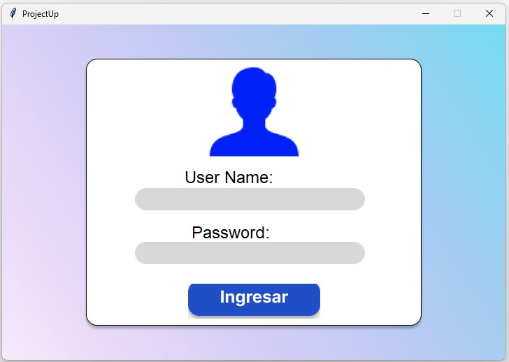

2.**Validación de Credenciales**: La aplicación verifica si las credenciales ingresadas son correctas y proporciona acceso si son válidas, de lo contrario, muestra un mensaje de error.

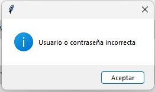

## Menú Project Manager:

3.**Carga de Archivos CSV y JSON**: Permite al Project manager cargar archivos CSV y JSON en la aplicación mediante botones específicos para cada tipo de archivo.

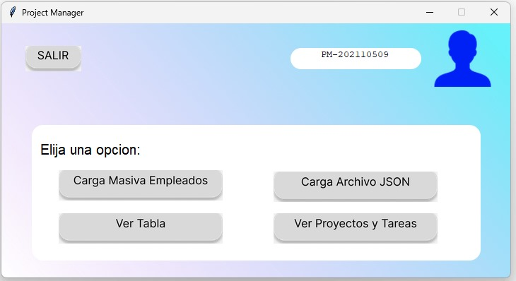

4.**Indicación de Carga Correcta**: Después de cargar un archivo CSV o JSON, la aplicación indica si la carga se realizó correctamente o no.

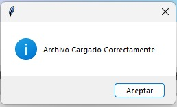

5.**Ver Tabla**: Permite al Project manager visualizar una tabla que representa gráficamente la tabla hash. Muestra información como el índice de almacenamiento, código de empleado, nombre y puesto de los usuarios.

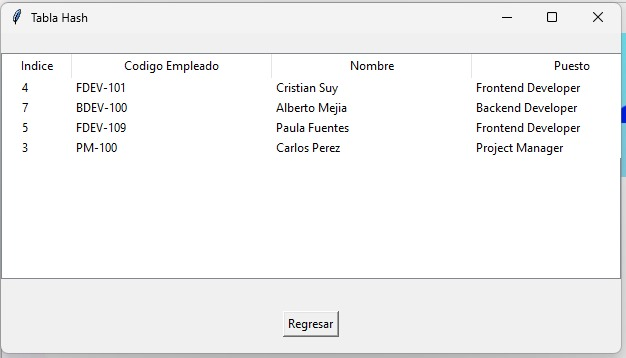

6.**Ver Proyectos y Tareas**: Abre una nueva ventana que muestra información adicional sobre los proyectos y tareas en el sistema.

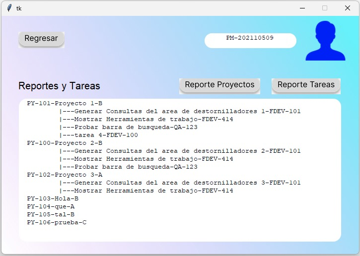

7.**Generación de Reportes**: Permite al Project manager generar automáticamente informes gráficos de proyectos y tareas haciendo clic en los botones "Reporte Proyectos" y "Reporte Tareas".

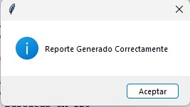
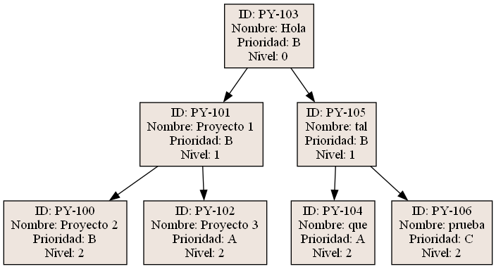
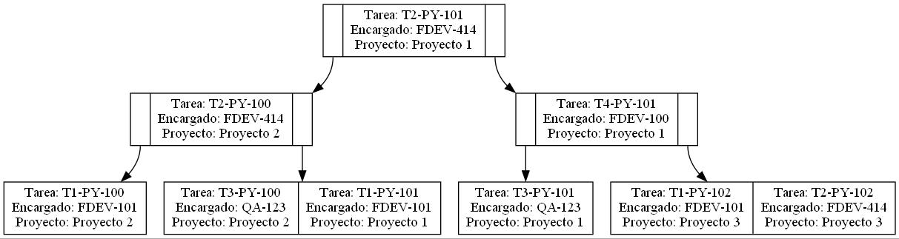

## Ventana Empleado:

8.**Visualización de Tareas**: Muestra al empleado una tabla con las tareas asignadas. Los datos visibles incluyen el Código de Tarea, Nombre del Proyecto y Nombre de la Tarea.

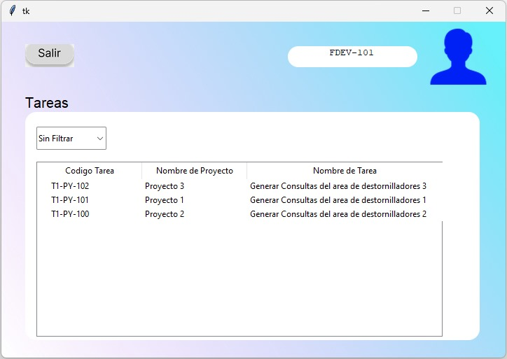

9.**Filtrado por Proyecto**: Permite al empleado filtrar la información de la tabla por medio del código de proyecto utilizando una lista desplegable. Al seleccionar un proyecto, se muestran solo las tareas asignadas a ese usuario dentro de ese proyecto.

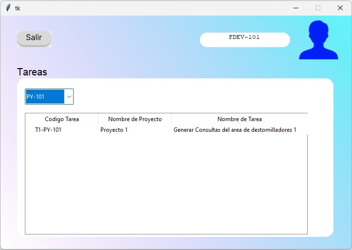